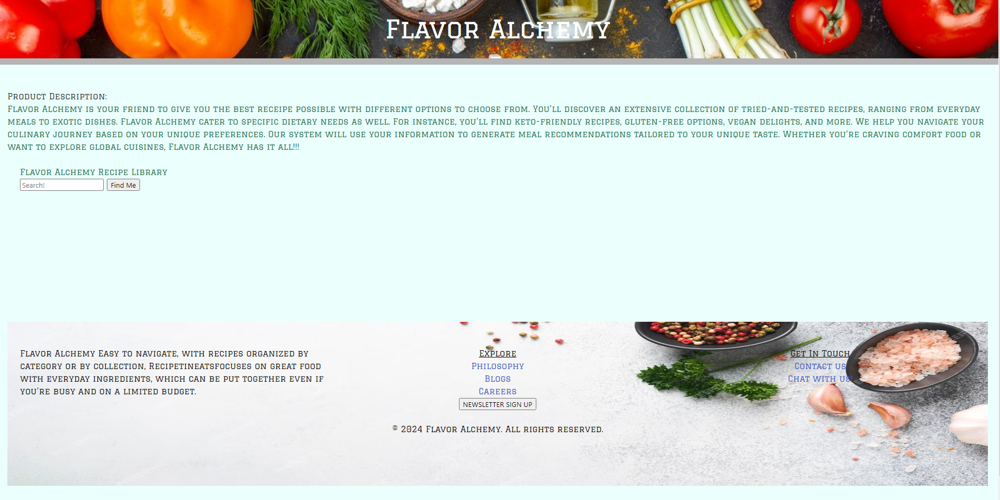
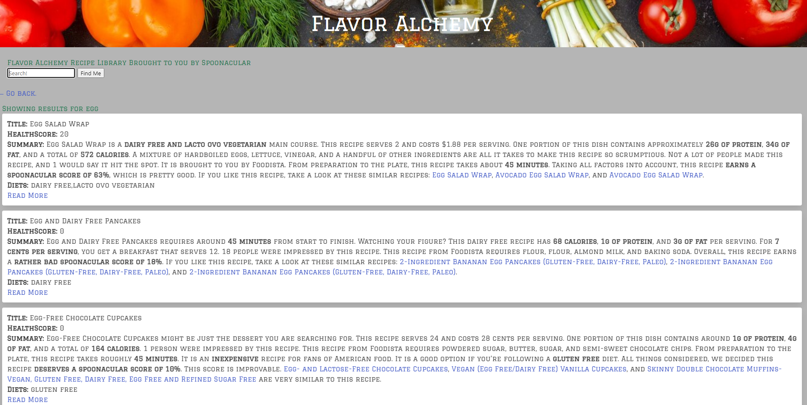

# Flavor Alchemy

## Table of Contents

- [Description](#description)
- [User Story](#user-story)
- [Acceptance Criteria](#acceptance-criteria)
- [Images](#images) 
- [Link To Deployed Webpage](#link-url-to-deployed-webpage)
- [Technologies Used](#technologies-used)
- [Third Party APIs](#third-party-apis)
- [Credits](#credits)

## Description

Developers are often tasked with retrieving data from another application's API and using it in the context of their own. Third-party APIs allow developers to access their data and functionality by making requests with specific parameters to a URL. The purpose of this application is to build a weather dashboard that will run in the browser and feature dynamically updated HTML and CSS.

## User Story
AS a new  USER, I can create a profile where I can specify my dietary preferences (e.g., vegetarian, vegan, gluten-free), allergies, and flavor preferences.
Returning users should be able to update their profile settings at any time

## Acceptance Criteria
- The application should provide a search functionality for pasta recipes.

- Users should be able to search recipes based on dietary preferences, such as vegetarian or gluten-free.

- Each recipe should include a list of ingredients and clear step-by-step instructions.

- The recipe information should be easy to read and accessible on desktop.

- The application could offer video tutorials for certain recipes to assist users in the cooking process.

## Images

## Link URL to deployed webpage

https://hammerc124.github.io/Group-Project-1/

## Technologies Used
Assignment was built with:
- Github
- Virtual Studio Code
- HTML
- CSS
- JAVASCRIPT
## Third Party APIs 
- https://spoonacular.com/food-api
- https://developer.edamam.com/edamam-docs-recipe-api

## Credits
- Webpage by: Adam Reed, Bahador Ravandi, Caleb Hammer, Ryan Lee
- Course: Bootcamp Full Stack Development
- Instructor: Ragheed Al-midani